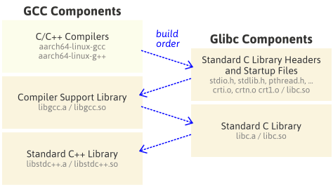

# arm64/AArch64交叉编译环境

## 系统环境

Archlinux on x86

## 参考文档

- [中文翻译版、环境变量的使用提高了容错率](https://zhuanlan.zhihu.com/p/113084121)

- 上一篇和老师推荐的参考文档竟然是同一个，详细介绍了每一步的作用：[How to Build a GCC Cross-Compiler](https://preshing.com/20141119/how-to-build-a-gcc-cross-compiler/)

- 编译gcc的过程中遇见问题`error: cannot compute suffix of object files: cannot compil`：[使用脚本安装gcc的依赖](https://stackoverflow.com/questions/12650493/checking-for-suffix-of-object-files-configure-error-cannot-compute-suffix-o)

## 实验步骤

### 一）准备工作

在一个`cross`目录下，我设置了三个文件夹：`build`、`install`和`src`，分别export为环境变量`CROSS_COMPILE_BUILD`、`CROSS_COMPILE_BUILD`和`CROSS_COMPILE_SRC`。并将未来的二进制文件目录加入PATH：

```bash
# at path/to/my/cross
mkdir src build install
export CROSS_COMPILE_SRC=src/
export CROSS_COMPILE_BUILD=build/
export CROSS_COMPILE_INSTALL=install/
export PATH=$CROSS_COMPILE_INSTALL/bin:$PATH
```

下载安装包，根据最新gcc编译脚本，无须手动安装gcc依赖：mpfr、mpc、isl、cloog等，所以第一步安装binutils、gcc、glibc、linux。因为我一直不太懂镜像源的具体用法，所以照搬参考中的做法(连切换USTC源的勇气也没有)：

```bash
cd $CROSS_COMPILE_SRC
export GNU_MIRROR_SITE=https://mirrors.tuna.tsinghua.edu.cn/gnu/
export KERNEL_MIRROR_SITE=https://mirrors.tuna.tsinghua.edu.cn/kernel/

wget $GNU_MIRROR_SITE/binutils/binutils-2.34.tar.xz                 # binutils
wget $GNU_MIRROR_SITE/gcc/gcc-9.2.0/gcc-9.2.0.tar.xz                # gcc
wget $GNU_MIRROR_SITE/glibc/glibc-2.31.tar.xz                       # glibc
wget $KERNEL_MIRROR_SITE/v4.x/linux-4.14.172.tar.xz                 # kernel
```

然后解压所有上述压缩文件

```bash
for f in *.tar.xz;  do tar -xJf $f; done
for f in *.tar.bz2; do tar -xjf $f; done
for f in *.tar.gz;  do tar -xzf $f; done
```

检查目录：

```bash
$ ls -d */
binutils-2.34/  gcc-9.2.0/  glibc-2.31/  linux-4.14.172/
```

进入gcc目录继续安装依赖：

```bash
cd $CROSS_COMPILE_SRC
./contrib/download_prerequisites
```

这一步会在gcc-9.2.0下下载并解压依赖的压缩包，并创建软连接指向相应目录

```bash
$ ll | grep '>'
lrwxrwxrwx  1 lixiaoqi lixiaoqi   12 Nov 10 13:33 gmp -> ./gmp-6.1.0/
lrwxrwxrwx  1 lixiaoqi lixiaoqi   11 Nov 10 13:33 isl -> ./isl-0.18/
lrwxrwxrwx  1 lixiaoqi lixiaoqi   12 Nov 10 13:33 mpc -> ./mpc-1.0.3/
lrwxrwxrwx  1 lixiaoqi lixiaoqi   13 Nov 10 13:33 mpfr -> ./mpfr-3.1.4/
```

编译线程数，因为编译gcc的时候如果用满八核，我的电脑会太过尽情以至关机，所以我使用7个线程。

```bash
# export NPROC=`nproc`
export NPROC=7
```

### 二）编译安装Binutils

> 在这一步之后就是照搬文档

```bash
cd $CROSS_COMPILE_BUILD
mkdir binutils
cd binutils
$CROSS_COMPILE_SRC/binutils-2.34/configure  \
    --prefix=$CROSS_COMPILE_INSTALL         \
    --target=aarch64-linux                  \
    --disable-multilib
make -j$NPROC
make install
```

configure命令中的参数

- `--target=aarch64-linux`会指定目标系统类型，这个脚本将会配置好安装目录和编译选项。

- `--disable-multilib`将会指定仅限于AArch64指令集。

这一步过后，在`$CROSS_COMPILE_INSTALL/bin`中会得到交叉汇编器、交叉链接器等工具。

### 三）安装linux Kernel头文件

这一步将linux kernel的头文件安装到`$CROSS_COMPILE_INSTALL/aarch64-linux`

```bash
cd $CROSS_COMPILE_SRC/linux-4.14.172
make                                                        \
    ARCH=arm64                                              \
    INSTALL_HDR_PATH=$CROSS_COMPILE_INSTALL/aarch64-linux   \
    headers_install
```

### 四）编译安装gcc和glibc

这一步是最耗时也是最容易出错的地方，因为GCC和Glibc的依赖关系是部分GCC依赖部分Glibc，反过来亦然。所以需要交替编译两个库的相关组件。

如果这一部分出现错误，要确保自己有按照文档步骤来，根据报错信息查找原因，实在不行就全部重新来一遍。



#### 1、编译器

这一步只会构建GCC的C与C++交叉编译器，将他们安装到`$CROSS_COMPILE_INSTALL/bin`下。

```bash
cd $CROSS_COMPILE_BUILD
mkdir gcc
cd gcc
$CROSS_COMPILE_SRC/gcc-9.2.0/configure  \
    --prefix=$CROSS_COMPILE_INSTALL     \
    --target=aarch64-linux              \
    --enable-language=c,c++             \
    --disable-multilib
make -j$NPROC all-gcc
make install-gcc
```

- `--target=aarch64-linux`与前面的相呼应，将会指定寻找带有`aarch64-linux-`的工具，同时，产生的C/C++编译器也会带有前缀`aarch64-linux-`
- `--enable-language=c,c++`将避免编译GCC的其他语言套件，如Java、Go等

漫长的等待后，没有error字样就可以进行下一步了。

#### 2、标准 C 头文件和启动文件

> 原文注：如果前面没有把 `$CROSS_COMPILE_INSTALL/bin` 加入到 `PATH` 中的话这一步会报错。

这一步中：

- GLibc的标准C头文件和启动文件将被安装至`$CROSS_COMPILE_INSTALL/aarch64-linux/include`

- 使用上一步编译出的C编译器编译启动文件，安装至`$CROSS_COMPILE_INSTALL/aarch64-linux/lib`

- 为了下一步需要，创建`libc.so`和`stubs.h`。这两个文件是临时，因为在下下步会被彻底替换。

```bash
cd $CROSS_COMPILE_BUILD
mkdir glibc
cd glibc
$CROSS_COMPILE_SRC/glibc-2.31/configure                         \
    --prefix=$CROSS_COMPILE_INSTALL/aarch64-linux               \
    --build=$MACHTYPE                                           \
    --host=aarch64-linux                                        \
    --target=aarch64-linux                                      \
    --with-headers=$CROSS_COMPILE_INSTALL/aarch64-linux/include \
    --disable-multilib                                          \
    libc_cv_forced_unwind=yes
make install-bootstrap-headers=yes install-headers
make -j$NPROC csu/subdir_lib
install csu/crt1.o csu/crti.o csu/crtn.o $CROSS_COMPILE_INSTALL/aarch64-linux/lib
aarch64-linux-gcc -nostdlib -nostartfiles -shared -x c /dev/null \
    -o $CROSS_COMPILE_INSTALL/aarch64-linux/lib/libc.so
touch $CROSS_COMPILE_INSTALL/aarch64-linux/include/gnu/stubs.h
```

#### 3、编译器支持库

这一步会使用C编译器和上一步产生的启动文件去编译编译器支持库。

最终产生：

- `$CROSS_COMPILE_INSTALL/lib/gcc/aarch64-linux/9.2.0`中的两个静态库 `libgcc.a`、`libgcc_eh.a`

- `$CROSS_COMPILE_INSTALL/aarch64-linux/lib64`中的动态库 `libgcc_s.so`

```bash
cd $CROSS_COMPILE_BUILD/gcc
make -j$NPORC all-target-libgcc
make install-target-libgcc
```

#### 4、编译标准C库

这一步完成glibc的构建，将标准C库文件安装至`$CROSS_COMPILE_INSTALL/aarch64-linux/lib`，

- 静态库：`libc.a`

- 动态库：`libc.so`

```bash
cd $CROSS_COMPILE_BUILD/glibc
make -j$NPROC
make install
```

#### 5、编译标准 C++ 库

> 文档对处理`PATH_MAX`未定义的报错进行了探讨

编译GCC的最后一步！使用上一步的C库编译C++库，将其安装至`$CROSS_COMPILE_INSTALL/aarch64-linux/lib64`

- 静态库：`libstdc++.a`

- 动态库：`libstdc++.so`

```bash
cd $CROSS_COMPILE_BUILD/gcc
make -j$NPROC
make install
```

### 五）测试

测试使用C程序如下：

```c
int f() { return 0; }
int main()
{
    int a;
    a = f();
    return 0;
}
```

使用两个编译器分别进行编译

```bash
aarch64-linux-gcc main.c -o arm.out
gcc main.c -o x86.out
```

首先利用readelf读取ELF头部信息

```bash
readelf -h x86.out > x86_readelf.txt
aarch64-linux-readelf  -h arm.out > arm_readelf.txt
```

diff查看elf头部信息的差别，可以看到ELF头部显示出的差异：

- 运行机差异：AArch64和X86-64。

- 程序入口点：0x400450和0x1020。

- 节头、程序头信息也不一致。

```bash
$ diff arm_readelf.txt x86_readelf.txt
8,9c8,9
<   Type:                              EXEC (Executable file)
<   Machine:                           AArch64
---
>   Type:                              DYN (Position-Independent Executable file)
>   Machine:                           Advanced Micro Devices X86-64
11c11
<   Entry point address:               0x400450
---
>   Entry point address:               0x1020
13c13
<   Start of section headers:          11176 (bytes into file)
---
>   Start of section headers:          18160 (bytes into file)
17c17
<   Number of program headers:         9
---
>   Number of program headers:         13
19,20c19,20
<   Number of section headers:         36
<   Section header string table index: 35
---
>   Number of section headers:         35
>   Section header string table index: 34
```

利用objdump反汇编

```bash
aarch64-linux-objdump  -d arm.out > arm_objdump.txt
objdump -d x86.out > x86_objdump.txt
```

```bash
$ cat x86_objdump.txt
...
0000000000001020 <_start>:
    1020:    f3 0f 1e fa              endbr64
    1024:    31 ed                    xor    %ebp,%ebp
...
0000000000001119 <f>:
    1119:    55                       push   %rbp
    111a:    48 89 e5                 mov    %rsp,%rbp
    111d:    b8 00 00 00 00           mov    $0x0,%eax
    1122:    5d                       pop    %rbp
    1123:    c3                       ret

0000000000001124 <main>:
    1124:    55                       push   %rbp
    1125:    48 89 e5                 mov    %rsp,%rbp
    1128:    48 83 ec 10              sub    $0x10,%rsp
    112c:    b8 00 00 00 00           mov    $0x0,%eax
    1131:    e8 e3 ff ff ff           call   1119 <f>
    1136:    89 45 fc                 mov    %eax,-0x4(%rbp)
    1139:    b8 00 00 00 00           mov    $0x0,%eax
    113e:    c9                       leave
    113f:    c3                       ret
...
$ cat arm_objdump.txt
...
0000000000400450 <_start>:
  400450:    d280001d     mov    x29, #0x0                       // #0
  400454:    d280001e     mov    x30, #0x0                       // #0
...
000000000040055c <f>:
  40055c:    52800000     mov    w0, #0x0                       // #0
  400560:    d65f03c0     ret

0000000000400564 <main>:
  400564:    a9be7bfd     stp    x29, x30, [sp, #-32]!
  400568:    910003fd     mov    x29, sp
  40056c:    97fffffc     bl    40055c <f>
  400570:    b9001fe0     str    w0, [sp, #28]
  400574:    52800000     mov    w0, #0x0                       // #0
  400578:    a8c27bfd     ldp    x29, x30, [sp], #32
  40057c:    d65f03c0     ret
...
```

输出中将无用信息抹去，这里的\<\_start\>可以看到两个目标文件的入口点不一致(0000000000001020和0000000000400450)，这也对应ELF的头部信息。宿主机的机器码对应着X86-64汇编，目标机的机器码对应arm64汇编。

查看文件的分段信息：

```bash
readelf -S x86.out > x86_readelf.txt
aarch64-linux-readelf  -S arm.out > arm_readelf.txt
```

```bash
$ cat x86_readelf.txt
There are 35 section headers, starting at offset 0x46f0:

Section Headers:
  [Nr] Name              Type             Address           Offset
       Size              EntSize          Flags  Link  Info  Align
  [ 0]                   NULL             0000000000000000  00000000
       0000000000000000  0000000000000000           0     0     0
  [ 1] .interp           PROGBITS         0000000000000318  00000318
       000000000000001c  0000000000000000   A       0     0     1
  [ 2] .note.gnu.pr[...] NOTE             0000000000000338  00000338
       0000000000000040  0000000000000000   A       0     0     8
  [ 3] .note.gnu.bu[...] NOTE             0000000000000378  00000378
       0000000000000024  0000000000000000   A       0     0     4
  [ 4] .note.ABI-tag     NOTE             000000000000039c  0000039c
       0000000000000020  0000000000000000   A       0     0     4
  [ 5] .gnu.hash         GNU_HASH         00000000000003c0  000003c0
       000000000000001c  0000000000000000   A       6     0     8
  [ 6] .dynsym           DYNSYM           00000000000003e0  000003e0
       0000000000000090  0000000000000018   A       7     1     8
  [ 7] .dynstr           STRTAB           0000000000000470  00000470
       0000000000000088  0000000000000000   A       0     0     1
  [ 8] .gnu.version      VERSYM           00000000000004f8  000004f8
       000000000000000c  0000000000000002   A       6     0     2
  [ 9] .gnu.version_r    VERNEED          0000000000000508  00000508
       0000000000000030  0000000000000000   A       7     1     8
  [10] .rela.dyn         RELA             0000000000000538  00000538
       00000000000000c0  0000000000000018   A       6     0     8
  [11] .init             PROGBITS         0000000000001000  00001000
       000000000000001b  0000000000000000  AX       0     0     4
  [12] .text             PROGBITS         0000000000001020  00001020
       0000000000000120  0000000000000000  AX       0     0     16
  [13] .fini             PROGBITS         0000000000001140  00001140
       000000000000000d  0000000000000000  AX       0     0     4
  [14] .rodata           PROGBITS         0000000000002000  00002000
       0000000000000004  0000000000000004  AM       0     0     4
  [15] .eh_frame_hdr     PROGBITS         0000000000002004  00002004
       0000000000000024  0000000000000000   A       0     0     4
  [16] .eh_frame         PROGBITS         0000000000002028  00002028
       0000000000000074  0000000000000000   A       0     0     8
  [17] .init_array       INIT_ARRAY       0000000000003e10  00002e10
       0000000000000008  0000000000000008  WA       0     0     8
  [18] .fini_array       FINI_ARRAY       0000000000003e18  00002e18
       0000000000000008  0000000000000008  WA       0     0     8
  [19] .dynamic          DYNAMIC          0000000000003e20  00002e20
       00000000000001a0  0000000000000010  WA       7     0     8
  [20] .got              PROGBITS         0000000000003fc0  00002fc0
       0000000000000028  0000000000000008  WA       0     0     8
  [21] .got.plt          PROGBITS         0000000000003fe8  00002fe8
       0000000000000018  0000000000000008  WA       0     0     8
  [22] .data             PROGBITS         0000000000004000  00003000
       0000000000000010  0000000000000000  WA       0     0     8
  [23] .bss              NOBITS           0000000000004010  00003010
       0000000000000008  0000000000000000  WA       0     0     1
  [24] .comment          PROGBITS         0000000000000000  00003010
       0000000000000012  0000000000000001  MS       0     0     1
  [25] .debug_aranges    PROGBITS         0000000000000000  00003030
       00000000000000f0  0000000000000000           0     0     16
  [26] .debug_info       PROGBITS         0000000000000000  00003120
       0000000000000594  0000000000000000           0     0     1
  [27] .debug_abbrev     PROGBITS         0000000000000000  000036b4
       00000000000001a5  0000000000000000           0     0     1
  [28] .debug_line       PROGBITS         0000000000000000  00003859
       00000000000001da  0000000000000000           0     0     1
  [29] .debug_str        PROGBITS         0000000000000000  00003a33
       000000000000047a  0000000000000001  MS       0     0     1
  [30] .debug_line_str   PROGBITS         0000000000000000  00003ead
       000000000000013e  0000000000000001  MS       0     0     1
  [31] .debug_rnglists   PROGBITS         0000000000000000  00003feb
       0000000000000042  0000000000000000           0     0     1
  [32] .symtab           SYMTAB           0000000000000000  00004030
       0000000000000378  0000000000000018          33    19     8
  [33] .strtab           STRTAB           0000000000000000  000043a8
       00000000000001d5  0000000000000000           0     0     1
  [34] .shstrtab         STRTAB           0000000000000000  0000457d
       000000000000016c  0000000000000000           0     0     1
Key to Flags:
  W (write), A (alloc), X (execute), M (merge), S (strings), I (info),
  L (link order), O (extra OS processing required), G (group), T (TLS),
  C (compressed), x (unknown), o (OS specific), E (exclude),
  D (mbind), l (large), p (processor specific)
```

```bash
$ cat arm_readelf.txt
There are 36 section headers, starting at offset 0x2ba8:

Section Headers:
  [Nr] Name              Type             Address           Offset
       Size              EntSize          Flags  Link  Info  Align
  [ 0]                   NULL             0000000000000000  00000000
       0000000000000000  0000000000000000           0     0     0
  [ 1] .interp           PROGBITS         0000000000400238  00000238
       000000000000001b  0000000000000000   A       0     0     1
  [ 2] .note.ABI-tag     NOTE             0000000000400254  00000254
       0000000000000020  0000000000000000   A       0     0     4
  [ 3] .hash             HASH             0000000000400278  00000278
       0000000000000024  0000000000000004   A       5     0     8
  [ 4] .gnu.hash         GNU_HASH         00000000004002a0  000002a0
       000000000000001c  0000000000000000   A       5     0     8
  [ 5] .dynsym           DYNSYM           00000000004002c0  000002c0
       0000000000000060  0000000000000018   A       6     1     8
  [ 6] .dynstr           STRTAB           0000000000400320  00000320
       000000000000003d  0000000000000000   A       0     0     1
  [ 7] .gnu.version      VERSYM           000000000040035e  0000035e
       0000000000000008  0000000000000002   A       5     0     2
  [ 8] .gnu.version_r    VERNEED          0000000000400368  00000368
       0000000000000020  0000000000000000   A       6     1     8
  [ 9] .rela.dyn         RELA             0000000000400388  00000388
       0000000000000018  0000000000000018   A       5     0     8
  [10] .rela.plt         RELA             00000000004003a0  000003a0
       0000000000000048  0000000000000018  AI       5    22     8
  [11] .init             PROGBITS         00000000004003e8  000003e8
       0000000000000014  0000000000000000  AX       0     0     4
  [12] .plt              PROGBITS         0000000000400400  00000400
       0000000000000050  0000000000000010  AX       0     0     16
  [13] .text             PROGBITS         0000000000400450  00000450
       00000000000001b4  0000000000000000  AX       0     0     8
  [14] .fini             PROGBITS         0000000000400604  00000604
       0000000000000010  0000000000000000  AX       0     0     4
  [15] .rodata           PROGBITS         0000000000400618  00000618
       0000000000000018  0000000000000000   A       0     0     8
  [16] .eh_frame_hdr     PROGBITS         0000000000400630  00000630
       000000000000004c  0000000000000000   A       0     0     4
  [17] .eh_frame         PROGBITS         0000000000400680  00000680
       00000000000000fc  0000000000000000   A       0     0     8
  [18] .init_array       INIT_ARRAY       0000000000410de8  00000de8
       0000000000000008  0000000000000008  WA       0     0     8
  [19] .fini_array       FINI_ARRAY       0000000000410df0  00000df0
       0000000000000008  0000000000000008  WA       0     0     8
  [20] .dynamic          DYNAMIC          0000000000410df8  00000df8
       00000000000001e0  0000000000000010  WA       6     0     8
  [21] .got              PROGBITS         0000000000410fd8  00000fd8
       0000000000000010  0000000000000008  WA       0     0     8
  [22] .got.plt          PROGBITS         0000000000410fe8  00000fe8
       0000000000000030  0000000000000008  WA       0     0     8
  [23] .data             PROGBITS         0000000000411018  00001018
       0000000000000010  0000000000000000  WA       0     0     8
  [24] .bss              NOBITS           0000000000411028  00001028
       0000000000000008  0000000000000000  WA       0     0     1
  [25] .comment          PROGBITS         0000000000000000  00001028
       0000000000000011  0000000000000001  MS       0     0     1
  [26] .debug_aranges    PROGBITS         0000000000000000  00001040
       0000000000000110  0000000000000000           0     0     16
  [27] .debug_info       PROGBITS         0000000000000000  00001150
       0000000000000288  0000000000000000           0     0     1
  [28] .debug_abbrev     PROGBITS         0000000000000000  000013d8
       000000000000019c  0000000000000000           0     0     1
  [29] .debug_line       PROGBITS         0000000000000000  00001574
       0000000000000285  0000000000000000           0     0     1
  [30] .debug_str        PROGBITS         0000000000000000  000017f9
       0000000000000301  0000000000000001  MS       0     0     1
  [31] .debug_loc        PROGBITS         0000000000000000  00001afa
       000000000000019b  0000000000000000           0     0     1
  [32] .debug_ranges     PROGBITS         0000000000000000  00001ca0
       00000000000000c0  0000000000000000           0     0     16
  [33] .symtab           SYMTAB           0000000000000000  00001d60
       0000000000000978  0000000000000018          34    79     8
  [34] .strtab           STRTAB           0000000000000000  000026d8
       0000000000000385  0000000000000000           0     0     1
  [35] .shstrtab         STRTAB           0000000000000000  00002a5d
       0000000000000149  0000000000000000           0     0     1
Key to Flags:
  W (write), A (alloc), X (execute), M (merge), S (strings), I (info),
  L (link order), O (extra OS processing required), G (group), T (TLS),
  C (compressed), x (unknown), o (OS specific), E (exclude),
  p (processor specific)
```

### 六）修改源码

经过我细致的分析，确定版本信息的输出在文件`cross/src/gcc-9.2.0/gcc/gcc.c`中。这个文件定义了若干输出函数，大致作用如下：

- `static bool driver_handle_option(...)`
  
  这个是分析参数的入口，会设置相关的flag。

- `int driver::maybe_print_and_exit () const`
  
  内部有`--version`的输出定义：
  
  ```c
    if (print_version)
      {
        // printf("Hi PB20111654, hello everyone!\n");
        printf (_("%s %s%s\n"), progname, pkgversion_string,
            version_string);
        printf ("Copyright %s 2019 Free Software Foundation, Inc.\n",
            _("(C)"));
        fputs (_("This is free software; see the source for copying conditions.  There is NO\n\
  warranty; not even for MERCHANTABILITY or FITNESS FOR A PARTICULAR PURPOSE.\n\n"),
           stdout);
        if (! verbose_flag)
      return 0;
  
        /* We do not exit here. We use the same mechanism of --help to print
       the version of the sub-processes. */
        fputc ('\n', stdout);
        fflush (stdout);
      }
  ```
  
  其中注释掉的就是我加入的部分。

- `static void print_configuration (FILE *file)`
  
  这个对应`-v`输出的后半部分，这个函数的最后写道：
  
  ```c
    if (! strncmp (version_string, compiler_version, n)
        && compiler_version[n] == 0)
      fnotice (file, "gcc version %s %s\n", version_string,
           pkgversion_string);
  ```
  
  修改这段字符串即可。

修改代码前的输出：

```bash
$ aarch64-linux-gcc --version
aarch64-linux-gcc (GCC) 9.2.0
Copyright (C) 2019 Free Software Foundation, Inc.
This is free software; see the source for copying conditions.  There is NO
warranty; not even for MERCHANTABILITY or FITNESS FOR A PARTICULAR PURPOSE.
$ aarch64-linux-gcc -v
Using built-in specs.
COLLECT_GCC=aarch64-linux-gcc
COLLECT_LTO_WRAPPER=/home/lixiaoqi/Documents/Courses/embedded/cross/install/libexec/gcc/aarch64-linux/9.2.0/lto-wrapper
Target: aarch64-linux
Configured with: /home/lixiaoqi/Documents/Courses/embedded/cross/src/gcc-9.2.0/configure --prefix=/home/lixiaoqi/Documents/Courses/embedded/cross/install --target=aarch64-linux --enable-language=c,c++ --disable-multilib
Thread model: posix
gcc version 9.2.0 (GCC)
```

修改代码，重新编译，再次测试：

```bash
$ aarch64-linux-gcc --version
Hi PB20111654, hello everyone!
aarch64-linux-gcc (GCC) 9.2.0
Copyright (C) 2019 Free Software Foundation, Inc.
This is free software; see the source for copying conditions.  There is NO
warranty; not even for MERCHANTABILITY or FITNESS FOR A PARTICULAR PURPOSE.
$ aarch64-linux-gcc -v
Using built-in specs.
COLLECT_GCC=aarch64-linux-gcc
COLLECT_LTO_WRAPPER=/home/lixiaoqi/Documents/Courses/embedded/cross/install/libexec/gcc/aarch64-linux/9.2.0/lto-wrapper
Target: aarch64-linux
Configured with: /home/lixiaoqi/Documents/Courses/embedded/cross/src/gcc-9.2.0/configure --prefix=/home/lixiaoqi/Documents/Courses/embedded/cross/install --target=aarch64-linux --enable-language=c,c++ --disable-multilib
Thread model: posix
gcc version 9.2.0 (GCC-lxq)
```

第一个命令注意第一行、第二个命令注意最后一行。
