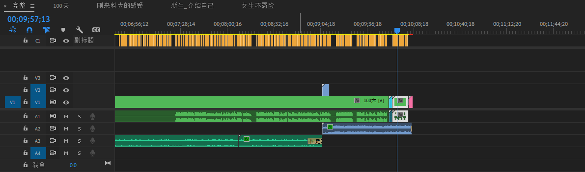
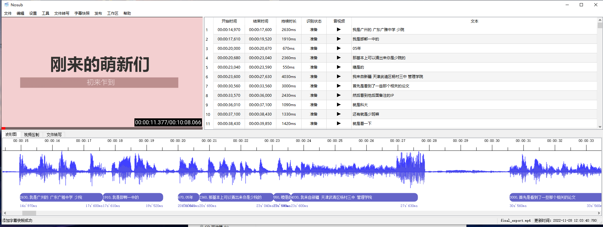
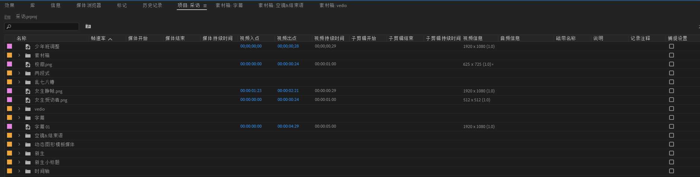

# 新生访谈 剪辑总结

> 上个周三，本来开会去晚了、又忘带校园卡，到了会议室附近又被门禁拦住，本想割掉这次的会来着。
> 
> 部长出来接我（真不好意思），还没领到会议室就问我是不是可以剪辑，能不能接一个采访的后期。
> 
> 我寻思这简单呀，采访视频就随便切几刀重组一下的事，正好这周格外清闲，所以愉快的接下了。
> 
> 周六给素材，周末交工，是个加急件。

而此时此刻，周一晚我坐在这里写总结，脑瓜袋还嗡嗡响，昨天没睡好没吃好，精神压力巨大，几次差点崩溃。果然是上手了才会知道各种各样的坑点，但是你回归到这个活本身，就是剪辑一个访谈视频，能有多难吗，还是自己缺乏经验。

在还没有剪完的时候，我就有一种强烈的愿望要做一个总结，我发现总结是可以给我带来爽感的事情。



## 最困难的部分

什么导致了我几近崩溃呢？是动画效果。

我有过：

- 视频剪辑的经验：小故事，健身vlog

- 有学过AE做科普动画的经验：地质科普视频

- 使用过傻瓜剪辑软件配效果：剪映做的蠢萌天鹅视频

接到所有素材之前，我做了一些简单的调研，敲定这个访谈需要的工作是：

- 剪出一个**序幕**，即把不同人的话组合出一段话，目的是集合有节目效果的只言片语，又能吸引观众、又能反映出新生们的态度。

- 主体**分段式结构**，根据问题重组回答，这个和上一条都是dirty work，没什么含金量还花时间，但是一条十分钟以内的视频不会花太久。

- 加入**动画效果**，开场动画、问题展示、标注地点等。

我以为有剪映保底，网上还有很多模板套用，实在不行我也可以自己做：制作动画效果会有一个比较小的时间开销。

这就是我最大的失误点：**没有认识到问题的棘手程度，过分轻视，导致心急吃不了热豆腐**。

自然是先寻找模板，自己在B站搜罗了一大圈，最后都是导向卖课的，各种关注公众号输入素材回复链接，然后点进去就是叫你买课，更有甚者，压缩包都解压好了，发现只有几个url文件，还有一张海报，没错又是卖课的。周六花了一下午，收获惨淡。

后来在周日，部长给我用她的包图网的VIP账户，我一阵搜罗还是没有能用的模板，一下午时间很快过去了。下载到的模板都不尽人意，主要是：

- 商务风格为主，不适合校园访谈。

- 文字动效模板，支持编辑的参数太少了，比如不能调字体、不能调整线框。

- 如果是动画工程文件，又会出现难以复用的情况：嵌套序列最后一级素材一旦被更改，所有实例都将被更改。

我下载了有近十个模板，放置模板的那个目录已然乱七八糟，他们的命名是什么`扁平商务风`、`13种文字效果`等，在最外层目录根本分不清哪个是哪个，所以就这样越来越乱套，时间流逝、毫无进展，所以近乎崩溃。

## 解决问题

总结嘛，不要抱怨太多，所有问题最后还都是被解决了，这里罗列一下碰到的问题及解决方案。

### 动画效果

想实现动画效果，我能想到的就这三种：自己做、套模板、剪映傻瓜式操作。

- 开场动画是模板文件，导入进项目来，替换图片、修改文字即可，比较简单。

- 展示采访的问题：**嵌套序列，你是个大坑**
  
  这里就出现了嵌套序列的问题，当你把嵌套序列复制后，修改A，很不幸B也会跟着变。我用了一个笨法解决：同时打开两个项目，在一个项目中做好了复制给另一个项目，应该是跨项目复制时会全部拷贝，所以能解决嵌套序列的问题。
  
  说其笨方法是因为它效率低、复用性差（我也不是很清楚里边的具体原理）。

- 标注地点
  
  这里就用了剪映帮助实现，剪辑到最后，我把原素材丢进剪映里加上地点标注，再在pr中替换原素材就行了，比较方便。

> 既然还是使用了剪映，为什么没有完全投奔剪映做动画呢？
> 
> 因为没有每个问题都要有一个动画引出，如果不做这些先空着，导出一段视频再丢个剪映，要在剪映里做很多**帧级**的剪切，会很麻烦。
> 
> 或者也可以把预剪好的片段（每个问题下的所有回答）都导出，然后在剪映里做二次剪辑。这涉及到导出队列，我当时不知道怎么一次性导出很多小片段，同时这些小片段的完成度很低，如果有更改就要全部重来一遍想想就麻烦。
> 
> > 据说使用`Adobe Media Encoder`可以导出多个片段，记住了下次用。
> 
> 还有很重要的一点，严肃创作还是不用剪映的好，所以尽量选择pr了。

### 导出失败

> [7种方法解决pr的导出失败](https://www.bilibili.com/video/BV1bt411T7xw/)
> 
> [如何彻底排查避免PR渲染错误、失败等各种问题？](https://zhuanlan.zhihu.com/p/83595879)

还被动画效果纠缠时，想着先把粗稿导出一份给大家看看效果，结果那时就导出失败了，血压飙升。根据直观来讲，工程越复杂，越容易导出失败，到后边开始添加动画效果，在给我导出失败，岂不是白忙活？

不过还好解决了，究竟什么原因，怎么针对性的解决我也不清楚，pr是个玄学软件。

我这次的尝试：

- 使用管理员运行。

- 升级N卡驱动。

- 调整导出设置，如编码格式(试试mov)、帧率、禁用硬件编码、VBR 2次等等。

试了很多，因为不是只导出一版，所以究竟哪个起了作用我也不清楚。

我看到很多说法，都挺有道理的：

- 立刻重新导出，可能就解决了，真玄学。

- 或者重启软件、重启电脑，这可能会清空缓存文件。

- 如果报错指示了错误点，针对那段素材检查，比如试试单独导出、试试做一些小调整。

- 经常是lumetri颜色和稳定器那里出现错误。

- 使用管理员运行。

- 使用`Adobe Media Encoder`导出。

- 禁用硬件编码。

- ……

### 字幕

- 部长给我说可以使用科大讯飞的语音识别，价格还算公道。

- 我选择的是这么一个[开源软件](https://github.com/patui/Nosub)，配合这个[教程](https://www.bilibili.com/video/BV1L54y167Z6/?spm_id_from=333.337.search-card.all.click&vd_source=8ad77f4be297a1c9673709147f3e1981)。很好上手。
  
  

- 挺铠哥说pr就有自带的语音识别，免费，woc舍近求远了。

Nosub开发者对于字幕制作平台做了详细的分析：[Nosub推荐的字幕制作平台](https://github.com/patui/Nosub/blob/master/%E6%8E%A8%E8%8D%90%E7%9A%84%E5%AD%97%E5%B9%95%E5%88%B6%E4%BD%9C%E5%B9%B3%E5%8F%B0.md)。

## 值得注意的点

其实我也是第一次接触访谈视频的制作，很多细节都值得记录。

### 前期

这次是两段，对新生刚来的采访（新生采访）和开学100天的采访（百日采访）。

- 新生采访是新生同学拍摄的，手机，画质确实不好，重点是收音差。

- 百日采访是xjc学姐拍摄，相加+小蜜蜂，画质音质没得挑，她还很细心地对视频进行了粗剪、重命名，拿到手的素材非常棒。

所以这里作为一个后期的视角：

- 前期的**画面、收音尽量做到最好**，不要想着后期可以调整，后期真的很心累！

- 向xjc学姐学习，**做好预剪**，素材做好重命名再交付，会让下一个人省心很多！

- **采访者要有经验一些**
  
    - 莫和受访者抢话说。因为最后一定是只剪有用的话进去，但是里边夹着掺着采访者的声音，你说这一段留不留？
  
    - 问题要有逻辑一些。
      
      这里主要是采访者拘泥于采访稿了，对话多少有些呆板。
      
      看下列对话：
      
      ```
      // 受访者明明说过了
      Q"刚来科大的感受"
      A"我觉得住宿挺好的"
      ……
      Q"你觉得宿舍条件怎么样"
      ```
      
      ```
      // 一个问题怎么拆两段了
      Q"你觉得食堂怎么样"
      A"伙食相当好"
      Q"学习压力大不大"
      A"还好吧……"
      Q"你最喜欢哪个食堂"
      ```

### 后期



这种采访视频，对每个问题都新建一个序列，这样的好处是：

- 项目清晰，总时间轴很简介，就像代码复用一样。（即使如此我的素材箱最后还是很混乱）

- 还会省去很多潜伏的麻烦：比如某一段添了几秒钟，那后边的序列都要向后拉给让出位置，即使使用了`向前选择轨道工具`进行拖动，有时候还是会覆盖掉某个片段（视频轨和音频轨的链接关系导致）。

做动画方面，可以看到我的问题：没有意识到加入动画效果并非容易事，急于求成和完美主义作祟，导致我拖来拖去。最后还是选了笨法……

## 总结

“都是这么摸索过来的嘛”

组内的小伙伴都给了很多鼓励呀，这种氛围真的很好。还有xjc学姐积极给我出点子，给我很多灵感，包括空镜、结尾语，也都是她的点子，她没有按部就班仅完成拍摄任务，很nice～
