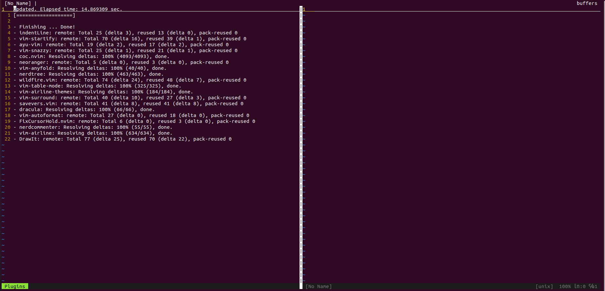

# neovim配置指南

vim的配置文件可以直接用于neovim，而一些插件只适用于neovim，所以我使用neovim而配置文件仍配置在`.vimrc`中。

这里以Ubuntu 20.04为例，走一遍我的neovim配置流程。

> 请确保网络畅通，科学上网。

## 安装neovim和其他依赖

```bash
sudo apt install neovim 
sudo apt install curl nodejs # coc.nvim's rely
sudo apt install clang-format autopep8 # auto format
```

## 获取配置文件

vim的配置文件一般为家目录下的`.vimrc`，当然也可以复写etc下的配置文件，这样使用root时也会获得相同的快捷键映射，不过root可能会因为未安装某些插件而报错，所以我主要修改`~/.vimrc`。

获取我的配置文件：

```bash
wget https://raw.githubusercontent.com/lixiaoqi-LXQ/config/master/vim/.vimrc -O ~/.vimrc
```

然后`gedit ~/.vimrc`，注释掉第14\~20行，关于备份文件的配置，之后可以自己创建相关目录，启用备份。

```vim
" set backup
" set patchmode=.bk
" set undofile
" set dir=~/tmp/vim_cache/swap
" set backupdir=~/tmp/vim_cache/backup
" set undodir=~/tmp/vim_cache/undos
" :let savevers_dirs = &backupdir
```

将`~/.vimrc`用于neovim，参考[Nvim - Neovim docs](https://neovim.io/doc/user/nvim.html#nvim-from-vim)。

## 安装vim-plug和vim插件

配置文件有针对插件管理器`vim-plug`和vim中各插件的自动安装，在终端敲入`nvim`，neovim会打开一个空的buffer，同时下载插件管理器和未安装的插件：



如果自动安装不成功，多半是网络问题，可以考虑手动安装，排查原因，以`vim-plug`为例：

```bash
curl -fLo ~/.vim/autoload/plug.vim \
      https://raw.githubusercontent.com/junegunn/vim-plug/master/plug.vim
```

## 版本问题

在记录这篇文档时并不知道Ubuntu 20.04安装很多旧版本，导致一些插件不兼容的问题。这些版本问题都可以通过修改软件源得到解决。比如coc.nvim对nodejs、nvim的版本都有要求，尝试修正版本问题即可。
