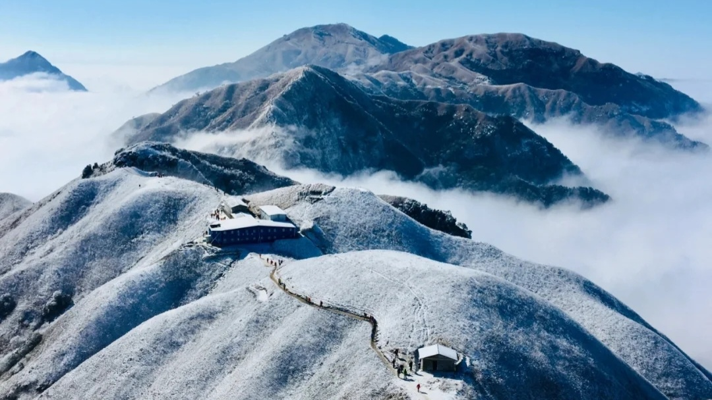
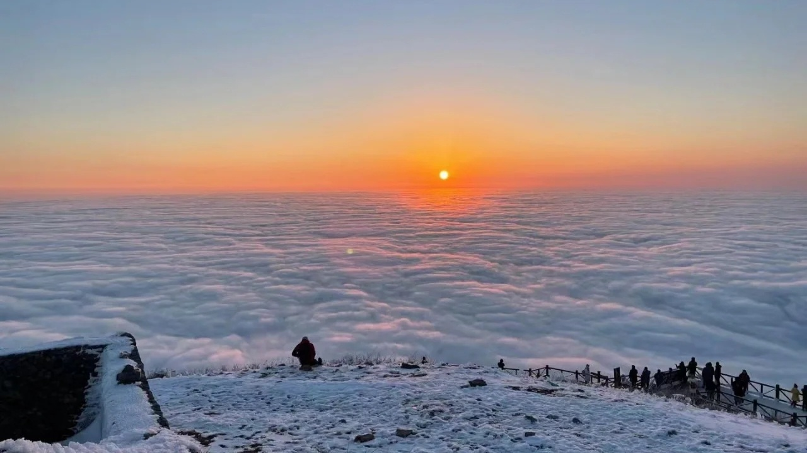
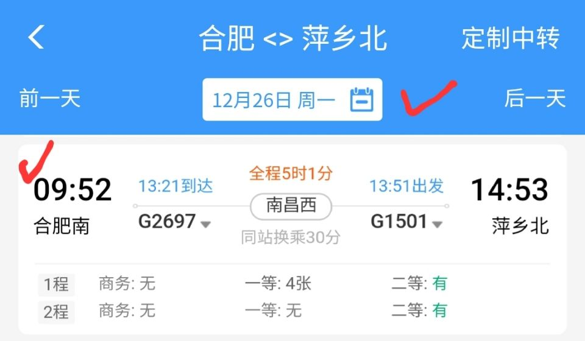
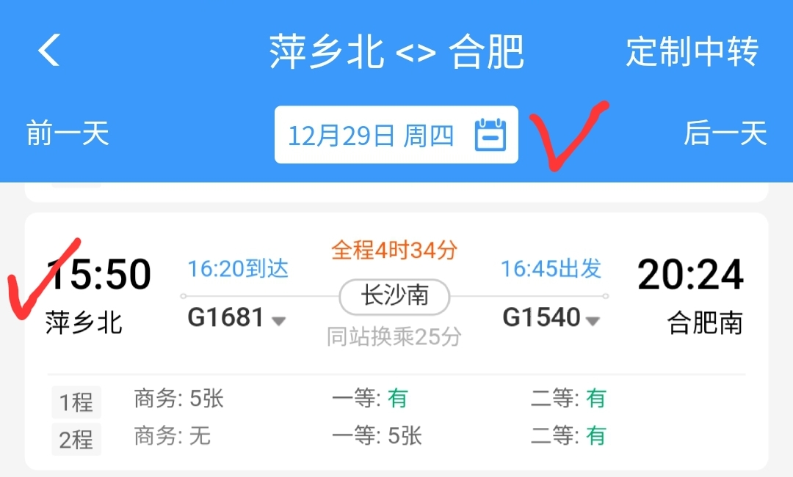
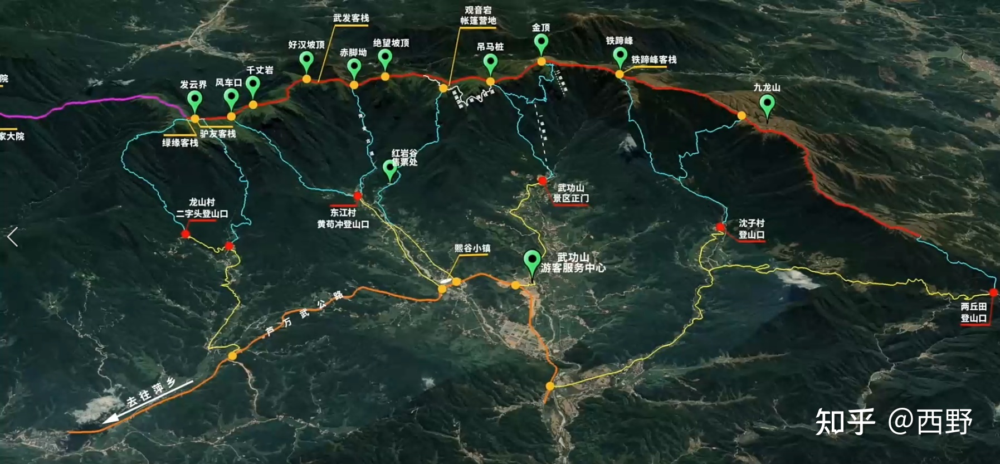

# 冬武功

> 

TODO：

- 采购物资、装备，收集药品

- 去协会借装备

- 完善预算计划

## 一）省流版

### 总时间安排

- Day1：从合肥，高铁，到达萍乡北站，前往沈子村住宿

- Day2：早起出发，沈子村至金顶

- Day3：金顶至好汉坡

- Day4：好汉坡至龙山村，然后回到合肥

### 总预算

> 都是按照单人算的，就是人均

交通：高铁(350元)+城市交通(50\*2)+返程(350)

住宿：沈子村住宿(35)+金顶露营收场地费(unknown)

补给：沈子村采购()+山顶补给()

回合肥腐败：

## 二）徒步路线

详细的下撤点及其他徒步线路详见：[武功山徒步穿越路线图全解 知乎](https://zhuanlan.zhihu.com/p/407350336)

### 详细时间安排：

> 主要在于交通方面的的时间安排

#### Day1 出发

8:00 集合前往合肥南站

9:52 发车 14:53 抵达萍乡北站

15:30 司机接车，预计 16:00 到达沈子村

沈子村住宿，在客栈吃晚饭

#### Day2 沈子村 to 金顶

7:00 起床

8:00 出发

预计走8小时，16:00左右到达金顶

17:00落日

#### Day3 金顶 to 好汉坡

5:00 起床看日出(如果没有的话另说)

准备好出发

这一天只走到好汉坡附近，所以边走边玩，时间绰绰有余

#### Day4 下山、回合肥

6:00 起床，吃早饭，下山

12:00 到达山脚 客栈吃午饭

13:30 来接车

### 天气

- 月末去的话，看中国气象+彩云天气预报会有小雨，气温在3～10度

- 山上风比较应该会比较大，所以要带防风的衣裤

- 气温不会结冰，感觉不用冰爪

### 路况

第一天上山的路偏野路，加上山林笼罩，就不见阳光，路会比较湿滑，有可能冷的时候会结霜结冰。

### 路线

关于路线，这篇文章介绍的很详细：[武功山徒步穿越路线图全解 知乎](https://zhuanlan.zhihu.com/p/407350336)

这篇文章提供了俯视图很清晰：[武功山徒步路线攻略 8264](https://m.8264.com/thread-5675496-1.html)，此外他走的路线和我们基本一致(我们不走下图左边的紫线部分)，他配有详细的实拍图片:+1:

全程30km左右，累积上升2600m。

第一天的上升比较多。后两天在山脊上是上上下下，也不算轻松，但好在我们里程数少(其实可以两天走完全程的)。

沈子村上至铁蹄峰的路线需要注意，不要走岔路，一下是一段引用：

> 需要特别注意在第三个石碑处要留意，不要走岔路。由于石碑字迹不是很清楚，石碑上方是铁蹄峰，左侧是横岭，右侧是九龙山。相当于丁字路口，石碑背后的路比较窄通向铁蹄峰，不注意看还以为是野路

还有上山的图文讲解，参见[武功山徒步路线攻略 8264](https://m.8264.com/thread-5675496-1.html)，搜索"*不要走错了*"定位相关内容。

之后上到山脊，就有人工修建的台阶了，轨迹清晰，~~我想不会走丢了吧~~

## 三）住宿/补给

### 客栈开店情况

> 信息主要来自向客栈老板咨询

金顶、发云界客栈正常营业

观音宕要预约

云中雾(铁蹄峰)正常营业

其他地方的客栈可能需要预约住宿才有人去

### 山上物价

> 很多帖子整理来的，不敢说准

山顶矿泉水：10元/550ml，也有说5元的

山顶热水：具体价格还没问到，开店才有，不过金顶、发云界那里也比较固定的开店营业。还有说法是有自动热水机，扫码几块钱那种。

吃的：炒饭/面条15  米饭5元 素材20 荤菜40～60

住客栈：如果真的天气恶劣需要住宿，那真的就要牺牲一下钱包了，金顶住宿几百起步，其他沿路的客栈能便宜些但是老板不一定在。

### 出发点物资补给

沈子村[山水户外驿站](http://image1.8264.com/wen/public/20220318/164761218580.jpg!t3w825h0)就有户外用品卖，我问了老板是有气罐卖的，

不会出现买不到东西的问题

## 四）医疗/救援

> [急救包装什么](https://www.bilibili.com/video/BV1wf4y1T7vU/?spm_id_from=333.788&vd_source=8ad77f4be297a1c9673709147f3e1981)

### 医疗包

- 扭伤：云南白药

- 外伤：棉签、碘伏、酒精(棉片)、创可贴、红药水

- 感冒新guan：999、布洛芬

- 包扎：绷带

- 保温：急救毯

### TODO——下撤方案

能打通的电话、附近的医院、下撤点的老乡家等。

## 五）End

**记得买保险**：*Done*

[平安保险-短期意外险](https://baoxian.pingan.com/pa18shopnst/nstShop/index.html#/productInfo/ZP020326?WT.mc_id=T00-WT-PAHOME-testA-cp34)

**救援电话**(可以再完善但没必要)

- 景区官方热线(已拨通)：0799-7636666

- 蓝天救援队电话：4006009958 

- 110

**更多资料**

- [客栈联系方式](https://pic3.zhimg.com/v2-0b6f7c59e3c540c3064fa380d21c28ca_r.jpg)

- [客栈电话](https://p1-q.mafengwo.net/s14/M00/D4/76/wKgE2l1wsGaAaZ60AAQLb0-ktB805.jpeg?imageView2%2F2%2Fw%2F1360%2Fq%2F90)

**其他**

- [我的装备](https://lighterpack.com/r/nqcld2)

- [如何科学的看天气预报](https://zhuanlan.zhihu.com/p/31845878?from_voters_page=true)

- [两步路户外助手使用教程1](https://www.2bulu.com/app/index_course_category.htm)、[两步路户外助手使用教程2](https://www.bilibili.com/video/BV1Mi4y117Zc/?spm_id_from=333.788.recommend_more_video.0&vd_source=8ad77f4be297a1c9673709147f3e1981)
